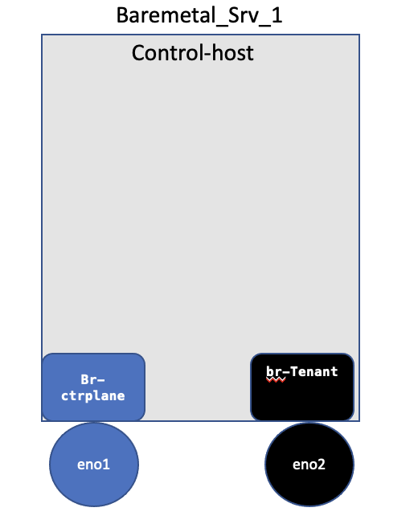
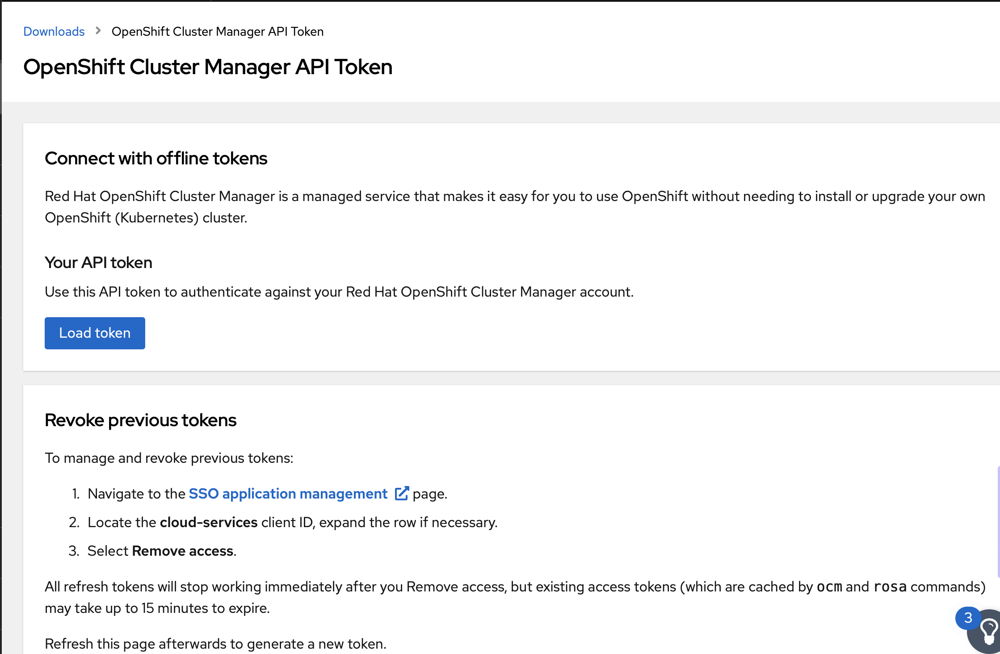

# RHOCP (Redhat Openshift) Juniper CN2 Installation via AI (Assisted Installer) with NMState and Redfish_API
## Background
* Redhat Openshift is getting lots of attractions in 5G RAN market due to its feature richness.
* 5G RAN VDU (virtual distribution unit, Far Edge) and VCU (virtual control unit, Edge DC) are the target places where Openshift is getting deployed besides region data center where 5G core components are placed.
* Courtesy to Redat for these design diagrams.


## Problem Statement
* Juniper Networks CN2 (Cloud Native, telco grade SDN Controller) has been recently certified with (RHOCP) Redhat Open Shift (Industry leading Container based orchestrator) for telco regional data centers, 5G RAN edge & far edge application and IT Cloud Applications (hosted in public / private clouds).
* At present CN2 installation with RHOCP is qualified via Assisted Installer (AI).
* Assisted Installer  is cloud hosted project which allows easy installation/ management  of OCP Clusters, it  also provides API calls to interact with the cluster for life cycle  operation of the cluster.
* With AI based installation, a discovery ISO image is required to be generated which images contain the all the required config (e.g. cluster they key, pull-secrets, network config and any ignition file required for temporary bootstrap node)
* Once the discovery ISO image is prepared, downloaded then target Openshift nodes need to boot with that discovery ISO.
* Juniper documentation assumes that OCP/ CN2 nodes are booted up with discovery ISO images as discovery ISO image is attached to OCP Node in some way.
* Juniper documentation also does not cover how to provide advanced networking config to target OCP nodes (e.g. if port bundle or Link Aggregation or VLAN tagging is required inside OCP target nodes).

## Proposed Solution and Work Flow
* I will cover how to add  static network configuration via NMstat into ISO image besides adding other required config.
* I will  also cover how to perform life cycle operations of OCP target nodes via Redfish API. 
* I will discuss how to attach discovery ISO images  to OCP target nodes remotely via http server and Redfish API.
* Once ISO image is remotely attached to OCP nodes as CD-ROM then their boot order needs to be changed to set CD-ROM as 1st boot order.
* OCP nodes will be powered on via Redfish API, and  nodes will boot from remotely attached ISO image.
* After booting up from  discovery ISO image,  OCP nodes will get the required config will  register themselves  with AI.
* Once OCP Nodes will reach "Preparing setup Successful" then their boot order needs to be changed from CD to HDD and cold-reboot is required.
* After cold reboot OCP nodes will boot from HDD and Openshift+CN2 installation will start.
## Note
* Although, I have deployed this Lab setup virtual machines but in reality 5G RAN (edge/ far edge) Openshift clusters would be running  on bare metal servers.
* I will cover bare metal RHOCP+CN2 deployments in in another wiki along with SRIOV and DPDK networking capabilities.
## References 
* [assisted-installer-deepdive](https://github.com/latouchek/assisted-installer-deepdive)
* [Juniper CN2 Documentation](https://www.juniper.net/documentation/us/en/software/cn-cloud-native22/cn-cloud-native-ocp-install-and-lcm/topics/task/cn-cloud-native-ocp-before-you-install.html)
* [Juniper CN2 and OCP Qauflied Verions](https://www.juniper.net/documentation/en_US/release-independent/contrail-cloud-native/topics/reference/cloud-native-contrail-supported-platforms.pdf)
* [Redhat AI API Document](https://access.redhat.com/documentation/en-us/assisted_installer_for_openshift_container_platform/2022/html/assisted_installer_for_openshift_container_platform/installing-with-api)
* [Sushi-Tools](https://cloudcult.dev/sushy-emulator-redfish-for-the-virtualization-nation/)
* [Redfish Eumulator](https://docs.openstack.org/sushy-tools/latest/user/index.html)
* [Redfish API](https://cloudcult.dev/fishing-for-sushy-with-curl/)
* [Redfish API Fix](https://opendev.org/openstack/sushy-tools/commit/cee6785048997aa4c8b4287b9fbffb3ecf52fc07?ref=cloud-cult-devops)
* [Useful Document to Understand OCP AI Process](https://cloudcult.dev/creating-openshift-clusters-with-the-assisted-service-api/#part-vii-generate-and-download-the-installation-media)
* [NMState](https://nmstate.io/examples.html)
* [NMState Examples](https://access.redhat.com/documentation/en-us/assisted_installer_for_openshift_container_platform/2022/html/assisted_installer_for_openshift_container_platform/assembly_network-configuration)

## Pre-Requisite
* Your Favourite Linux distro is installed on KVM host, in my case it's Ubuntu 20.04.
* Install required packages on KVM host.
```
sudo apt update
sudo apt install qemu-kvm libvirt-daemon-system libvirt-clients bridge-utils
sudo systemctl enable --now libvirtd
```

* Net-plane config for my KVM Host
```
network:
    ethernets:
        eno1:
            dhcp4: no
            optional: true
        eno2:
            dhcp4: no
            optional: true
    bridges:
        br-ctrplane:
            interfaces: [eno1]
            addresses: [192.168.24.10/24]
            gateway4: 192.168.24.1
            nameservers:
               addresses: [1.1.1.1, 8.8.8.8]
        br-Tenant:
            interfaces: [eno2]
            addresses: [192.168.5.10/24]
    version: 2
```


## Execution
### Topology 

### Create VMs on KVM Host 
* Due to paucity of resources I am using single KVM server to host all OCP nodes (3 Controllers and 2 worker nodes).
#### Creating libvirt Storage Pool
```
sudo virsh pool-list --all
sudo mkdir -p /var/lib/libvirt/sushy-host
sudo virsh pool-define-as default --type dir --target /var/lib/libvirt/sushy-host
sudo virsh pool-autostart default
sudo virsh pool-start default
```
#### VM Defination 
```
sudo virt-install -n master01.ocp.pxe.com \
 --description "master01 Machine for Openshift 4 Cluster" \
 --ram=16384 \
 --vcpus=8 \
 --os-type=Linux \
 --os-variant=rhel8.0 \
 --noreboot \
 --disk pool=images,bus=virtio,size=200 \
 --graphics vnc,listen=0.0.0.0  \
 --boot hd,menu=on \
 --events on_reboot=destroy \
 --network bridge=br-ctrplane,mac=52:54:00:8b:a1:17 \
 --network bridge=br-Tenant,mac=52:54:00:8b:a1:18


sudo virt-install -n master02.ocp.pxe.com  \
 --description "Master02 Machine for Openshift 4 Cluster" \
 --ram=16384 \
 --vcpus=8 \
 --os-type=Linux \
 --os-variant=rhel8.0 \
 --noreboot \
 --disk pool=images,bus=virtio,size=200 \
 --graphics vnc,listen=0.0.0.0  \
 --boot hd,menu=on \
 --events on_reboot=destroy \
 --network bridge=br-ctrplane,mac=52:54:00:ea:8b:9d \
 --network bridge=br-Tenant,mac=52:54:00:ea:8b:9c

sudo virt-install -n master03.ocp.pxe.com  \
--description "Master03 Machine for Openshift 4 Cluster" \
--ram=16384 \
--vcpus=8 \
--os-type=Linux \
--os-variant=rhel8.0 \
 --noreboot \
--disk pool=images,bus=virtio,size=200 \
--graphics vnc,listen=0.0.0.0 \
--boot hd,menu=on \
--events on_reboot=destroy \
--network bridge=br-ctrplane,mac=52:54:00:f8:87:c7 \
--network bridge=br-Tenant,mac=52:54:00:f8:87:c8

sudo virt-install -n worker01.ocp.pxe.com \
 --description "worker01 Machine for Openshift 4 Cluster" \
 --ram=16384 \
 --vcpus=8 \
 --os-type=Linux \
 --os-variant=rhel8.0 \
 --noreboot \
 --disk pool=images,bus=virtio,size=200 \
 --graphics vnc,listen=0.0.0.0  \
 --boot hd,menu=on \
 --events on_reboot=destroy \
 --network bridge=br-ctrplane,mac=52:54:00:31:4a:38 \
 --network bridge=br-Tenant,mac=52:54:00:31:4a:39

 sudo virt-install -n worker02.ocp.pxe.com \
 --description "worker02 Machine for Openshift 4 Cluster" \
 --ram=16384 \
 --vcpus=8 \
 --os-type=Linux \
 --os-variant=rhel8.0 \
 --noreboot \
 --disk pool=images,bus=virtio,size=200 \
 --graphics vnc,listen=0.0.0.0 \
 --boot hd,menu=on \
 --events on_reboot=destroy \
 --network bridge=br-ctrplane,mac=52:54:00:6a:37:32 \
 --network bridge=br-Tenant,mac=52:54:00:6a:37:33 
```
#### Configure Sushi-Emulartor on KVM Host
* I followed the [link](https://cloudcult.dev/sushy-emulator-redfish-for-the-virtualization-nation/)  and [link](https://cloudcult.dev/fishing-for-sushy-with-curl/) to setup Suhi and use it alongwith Redfish API to manage VMs.
* Sushi-Emulator will be created as Podman container and later on Podman container can be configured as systemd service
* Hence, I am using Ubuntu 20.04 on my KVM host, so installing Podman was bit challenging on Ubunut, I followed following links to install Podman on my kvm host , reffered as control-host  in my topology. 
* [Link](https://www.microhost.com/docs/tutorial/how-to-install-podman-on-ubuntu-20-04-lts/)
* [Link](https://askubuntu.com/questions/1296657/unable-to-install-podman-in-ubuntu-20-04-running-on-wsl2-in-windows-10)
* [Link](https://stackoverflow.com/questions/73942531/podman-unable-to-build-image-from-dockerfile-error-creating-overlay-mount)

* If the KVM host is based on RHEL, Centos or Fedora then installing Podman is fairly straight forward.
* Create config file for sushi emulator
```
mkdir -p /etc/sushy/
cat << EOF > /etc/sushy/sushy-emulator.conf
SUSHY_EMULATOR_LISTEN_IP = u'0.0.0.0'
SUSHY_EMULATOR_LISTEN_PORT = 8000
SUSHY_EMULATOR_SSL_CERT = None
SUSHY_EMULATOR_SSL_KEY = None
SUSHY_EMULATOR_OS_CLOUD = None
SUSHY_EMULATOR_LIBVIRT_URI = u'qemu:///system'
SUSHY_EMULATOR_IGNORE_BOOT_DEVICE = False
SUSHY_EMULATOR_BOOT_LOADER_MAP = {
    u'UEFI': {
        u'x86_64': u'/usr/share/OVMF/OVMF_CODE.secboot.fd'
    },
    u'Legacy': {
        u'x86_64': None
    }
}
EOF 
```
#### Creating Sushy-Emulator Container
```
export SUSHY_TOOLS_IMAGE=${SUSHY_TOOLS_IMAGE:-"quay.io/metal3-io/sushy-tools"}
sudo podman create --net host --privileged --name sushy-emulator -v "/etc/sushy":/etc/sushy -v "/var/run/libvirt":/var/run/libvirt "${SUSHY_TOOLS_IMAGE}" sushy-emulator -i :: -p 8000 --config /etc/sushy/sushy-emulator.conf
podman start sushy-emulator
```
* Verify Sushy-Emulator from KVM host itself.
```
curl http://127.0.0.1:8000/redfish/v1/Managers
{
    "@odata.type": "#ManagerCollection.ManagerCollection",
    "Name": "Manager Collection",
    "Members@odata.count": 6,
    "Members": [

          {
              "@odata.id": "/redfish/v1/Managers/05963fbc-391a-4275-a65f-219e2075150b"
          },

          {
              "@odata.id": "/redfish/v1/Managers/9fa8ae2b-5a4c-4048-a7c6-a95d342fc00f"
          },

          {
              "@odata.id": "/redfish/v1/Managers/b667a771-c4b9-457e-899b-8930e7ba1ad1"
          },

          {
              "@odata.id": "/redfish/v1/Managers/bea822c5-f0c4-43b7-974e-ec1b0945c470"
          },

          {
              "@odata.id": "/redfish/v1/Managers/c57818a6-0551-4007-a6a3-16abc50b2087"
          },

          {
              "@odata.id": "/redfish/v1/Managers/f615f0ac-ea49-4c55-a6e7-1d386cb495cd"
          }

    ],
    "Oem": {},
    "@odata.context": "/redfish/v1/$metadata#ManagerCollection.ManagerCollection",
    "@odata.id": "/redfish/v1/Managers",
    "@Redfish.Copyright": "Copyright 2014-2017 Distributed Management Task Force, Inc. (DMTF). For the full DMTF copyright policy, see http://www.dmtf.org/about/policies/copyright."
}root@control-host:~#
```
* Creating Systemd Service to autostart sushy-emulator in case if KVM Host get reboot.
```
sudo sh -c 'podman generate systemd --restart-policy=always -t 1 sushy-emulator > /etc/systemd/system/sushy-emulator.service'
sudo systemctl daemon-reload
sudo systemctl restart sushy-emulator.service
udo systemctl enable sushy-emulator.service
Created symlink /etc/systemd/system/multi-user.target.wants/sushy-emulator.service → /etc/systemd/system/sushy-emulator.service.
Created symlink /etc/systemd/system/default.target.wants/sushy-emulator.service → /etc/systemd/system/sushy-emulator.service.

sudo systemctl status sushy-emulator.service
● sushy-emulator.service - Podman container-92d7a79e25fde4e340d6844665d83f65987dbc887391d6752cdbd3cf00ae3f35.service
   Loaded: loaded (/etc/systemd/system/sushy-emulator.service; enabled; vendor preset: enabled)
   Active: active (running) since Sun 2023-03-05 05:09:33 UTC; 433ms ago
     Docs: man:podman-generate-systemd(1)
 Main PID: 22652 (conmon)
    Tasks: 0 (limit: 14745)
   CGroup: /system.slice/sushy-emulator.service
           ‣ 22652 /usr/libexec/podman/conmon --api-version 1 -c 92d7a79e25fde4e340d6844665d83f65987dbc887391d6752cdbd3cf00ae3f35 -u 92d7a79e25fde4e340d6844665d83f65987dbc887391d

Mar 05 05:09:33 control-host systemd[1]: Starting Podman container-92d7a79e25fde4e340d6844665d83f65987dbc887391d6752cdbd3cf00ae3f35.service...
Mar 05 05:09:33 control-host systemd[1]: Started Podman container-92d7a79e25fde4e340d6844665d83f65987dbc887391d6752cdbd3cf00ae3f35.service.
root@control-host:~# podman ps
CONTAINER ID  IMAGE                                 COMMAND               CREATED     STATUS         PORTS       NAMES
92d7a79e25fd  quay.io/metal3-io/sushy-tools:latest  sushy-emulator -i...  7 days ago  Up 7 days ago              sushy-emulator
root@control-host:~# sudo cat /etc/systemd/system/sushy-emulator.service
# container-92d7a79e25fde4e340d6844665d83f65987dbc887391d6752cdbd3cf00ae3f35.service
# autogenerated by Podman 3.4.2
# Sun Mar  5 05:09:14 UTC 2023

[Unit]
Description=Podman container-92d7a79e25fde4e340d6844665d83f65987dbc887391d6752cdbd3cf00ae3f35.service
Documentation=man:podman-generate-systemd(1)
Wants=network-online.target
After=network-online.target
RequiresMountsFor=/run/containers/storage

[Service]
Environment=PODMAN_SYSTEMD_UNIT=%n
Restart=always
TimeoutStopSec=61
ExecStart=/usr/bin/podman start 92d7a79e25fde4e340d6844665d83f65987dbc887391d6752cdbd3cf00ae3f35
ExecStop=/usr/bin/podman stop -t 1 92d7a79e25fde4e340d6844665d83f65987dbc887391d6752cdbd3cf00ae3f35
ExecStopPost=/usr/bin/podman stop -t 1 92d7a79e25fde4e340d6844665d83f65987dbc887391d6752cdbd3cf00ae3f35
PIDFile=/run/containers/storage/overlay-containers/92d7a79e25fde4e340d6844665d83f65987dbc887391d6752cdbd3cf00ae3f35/userdata/conmon.pid
Type=forking

[Install]
WantedBy=multi-user.target default.target
```
### Creating Jumphost VM
* I am using Centos8 as my jumphost ,one can choose any Linux distro. 
```
wget 'https://cloud.centos.org/centos/8/x86_64/images/CentOS-8-GenericCloud-8.4.2105-20210603.0.x86_64.qcow2'
sudo qemu-img create -b /var/lib/libvirt/images/CentOS-8-GenericCloud-8.4.2105-20210603.0.x86_64.qcow2  -f qcow2 -F qcow2 /var/lib/libvirt/images/ocp_pxe_jumphost.qcow2 200G

sudo virt-customize  -a /var/lib/libvirt/images/ocp_pxe_jumphost.qcow2   --run-command 'xfs_growfs /' --selinux-relabel

cat > ocp_pxe_jumphost_cloud_init.cfg <<END_OF_SCRIPT
#cloud-config
hostname: bastion
fqdn: bastion.ocp.pxe.com
manage_etc_hosts: false
users:
  - name: lab
    groups: wheel
    lock_passwd: false
    shell: /bin/bash
    home: /home/lab
    ssh_pwauth: true
    ssh-authorized-keys:
      - 'ssh-key'
    sudo: ['ALL=(ALL) NOPASSWD:ALL']
chpasswd:
  list: |
     lab:contrail123
  expire: False
write_files:
  - path:  /etc/sudoers.d/lab
    permissions: '0440'
    content: |
         lab ALL=(root) NOPASSWD:ALL
  - path:  /etc/sysconfig/network-scripts/ifcfg-eth0
    permissions: '0644'
    content: |
         TYPE=Ethernet
         PROXY_METHOD=none
         BROWSER_ONLY=no
         BOOTPROTO=none
         IPV4_FAILURE_FATAL=no
         NAME=eth0
         DEVICE=eth0
         ONBOOT=yes
         IPADDR=192.168.24.13
         NETMASK=255.255.255.0
         GATEWAY=192.168.24.1
         DNS1=1.1.1.1
         PEERDNS=yes
runcmd:
 - [sudo, ifup, eth0]
 - [sudo, sed ,-i, 's/PasswordAuthentication no/PasswordAuthentication yes/g', /etc/ssh/sshd_config]
 - [sudo, systemctl, restart, sshd]
END_OF_SCRIPT

cloud-localds -v  ocp_pxe_jumphost_cloud_init.img ocp_pxe_jumphost_cloud_init.cfg


virt-install --name ocp_pxe_jumphost \
  --virt-type kvm --memory 16384  --vcpus 8 \
  --boot hd,menu=on \
  --disk path=ocp_pxe_jumphost_cloud_init.img,device=cdrom \
  --disk path=/var/lib/libvirt/images/ocp_pxe_jumphost.qcow2,device=disk \
  --os-type=Linux \
  --os-variant=rhel8.0 \
  --network bridge:br-ctrplane \
  --graphics vnc,listen=0.0.0.0 --noautoconsole
```
#### Installing Required Packages on Jumphost
* Login to Jumphost.  
```
cd ~/
cat <<EOF> jmphost_setup.sh
sudo dnf --disablerepo '*' --enablerepo=extras swap centos-linux-repos centos-stream-repos -y
sudo dnf distro-sync -y
sudo dnf -y install epel-release
sudo dnf -y install  git dhcp-server  syslinux  httpd   bind bind-utils  vim wget curl bash-completion  tree tar libselinux-python3 firewalld chrony
sudo reboot
EOF
chmod +x jmphost_setup.sh
./jmphost_setup.sh
```
#### Enabling Required Servcies and Firewall Rules on Jumphost 
* Clone this Git Repo
```
git clone https://github.com/kashif-nawaz/RHOCP_CN2_AI_NMState_Redfish_API.git
```
* Preparing named server 
* Copy named.conf ,reverse.db and reverse.db into your jumphost and do required changes as per your setup. 
```
sudo cp -rv ~/RHOCP_CN2_AI_NMState_Redfish_API/named.conf  /etc
sudo cp -rv  ~/RHOCP_CN2_AI_NMState_Redfish_API/reverse.db /var/named/
sudo cp -rv ~/RHOCP_CN2_AI_NMState_Redfish_API/zonefile.db /var/named/
sudo nmcli connection modify eth0 ipv4.dns 127.0.0.1
sudo nmcli connection modify eth0 ipv4.dns-search ocp.pxe.com
sudo nmcli connection modify eth0 ipv4.ignore-auto-dns yes
sudo systemctl restart NetworkManager
```
* Preparing ntp server 
```

sudo vim /etc/chrony.conf
allow 192.168.24.0/24
```
* Preparing Web Server
```
sudo mkdir -p /var/www/html/rhcos
sudo sed -i 's/Listen 80/Listen 0.0.0.0:8080/' /etc/httpd/conf/httpd.conf
```
* Adding Firewall Rules 

```
sudo firewall-cmd --add-port=8080/tcp --permanent
sudo firewall-cmd --add-service={ntp,http,https,dns} --permanent
sudo firewall-cmd --reload
```
* Enabling , Starting the Services

```
sudo systemctl enable httpd --now
sudo systemctl enable named --now 
sudo systemctl enable chronyd --now 
```

### Preparing OCP AI Installation on Jumphost
* Login to  [Redhat Portal](https://console.redhat.com/openshift/token?ref=cloud-cult-devops)

* Save the token in your system
```
OFFLINE_ACCESS_TOKEN=$(<offline_token.txt)
```
* Export TOKEN into your environment to get access to AI resources.
* This token will expire every 5 minutes, so you need to refresh the following token if any of the steps in subsequent sections get failed due to token expiry.
```
export TOKEN=$(curl \
--silent \
--data-urlencode "grant_type=refresh_token" \
--data-urlencode "client_id=cloud-services" \
--data-urlencode "refresh_token=${OFFLINE_ACCESS_TOKEN}" \
https://sso.redhat.com/auth/realms/redhat-external/protocol/openid-connect/token | \
jq -r .access_token)
```
* Verify if AI API is accessible. 
```
curl -s https://api.openshift.com/api/assisted-install/v2/component-versions -H "Authorization: Bearer ${TOKEN}" | jq
```
* Get pull secret from [Redhat Portal](https://console.redhat.com/openshift/install/pull-secret?ref=cloud-cult-devops)

* Save the pull secret into your system.
* Get access token from Juniper account team to access Juniper Images Registry enterprise.hub.juniper.net.
* Merge the Red Hat Pull-Secret and CN2 Pull Secret into a single file.
```
cat cn2-pull-secret | jq .

{
  "auths": {
    "enterprise-hub.juniper.net": {
      "auth": "token---",
      "email": "email--"
    }
  }
}

cat ocp-pull-secret | jq .
{
  "auths": {
    "cloud.openshift.com": {
      "auth": "token---",
      "email": "email"
    },
    "quay.io": {
      "auth": "token---",
      "email": "email"
    },
    "registry.connect.redhat.com": {
      "auth": "token---",
      "email": "email"
    },
    "registry.redhat.io": {
      "auth": "token---",
      "email": "email"
    }
  }
}

jq -s '.[0] * .[1]' ocp-pull-secret cn2-pull-secret | jq -c >combine-pull-secret
export PULL_SECRET=$(sed '/^[[:space:]]*$/d' combine-pull-secret | jq -R .)
```
* Genrete ssh-key in Jumphost.
```
ssh-keygen -q -t rsa -N '' -f ~/.ssh/id_rsa <<<y >/dev/null 2>&1 
export CLUSTER_SSH_KEY="$(cat .ssh/id_rsa.pub)"
```
* Prepare deployment file. 
```
export ASSISTED_SERVICE_API="https://api.openshift.com"
export CLUSTER_VERSION="4.8"
export CLUSTER_IMAGE="quay.io/openshift-release-dev/ocp-release:4.8.0-x86_64"
export CLUSTER_NAME="ocp"
export CLUSTER_DOMAIN="pxe.com"
export CLUSTER_NET_CIDR="10.128.0.0/14"
export CLUSTER_HOST_PFX="23" 
export CLUSTER_SVC_CIDR="172.31.0.0/16"
export NTP_SOURCE="192.168.24.13"
export CLUSTER_MACHINE_CIDR="192.168.24.0/24"
export CLUSTER_API_VIP=192.168.24.198
export CLUSTER_INGRESS_VIP=192.168.24.199

cat << EOF > ./deployment.json 
{ 
  "kind": "Cluster", 
  "name": "$CLUSTER_NAME", 
  "openshift_version": "$CLUSTER_VERSION", 
  "ocp_release_image": "$CLUSTER_IMAGE", 
  "base_dns_domain": "$CLUSTER_DOMAIN", 
  "hyperthreading": "all", 
  "machine_networks": [{"cidr": "192.168.24.0/24"}],
  "cluster_network_cidr": "$CLUSTER_NET_CIDR", 
  "cluster_network_host_prefix": $CLUSTER_HOST_PFX, 
  "service_network_cidr": "$CLUSTER_SVC_CIDR", 
  "user_managed_networking": false, 
  "vip_dhcp_allocation": false, 
  "additional_ntp_source": "$NTP_SOURCE", 
  "ssh_public_key": "$CLUSTER_SSH_KEY", 
  "pull_secret": $PULL_SECRET 
} 
EOF
```
* Create  OCP Cluster 
```
export CLUSTER_ID=$(curl -s -X POST "$ASSISTED_SERVICE_API/api/assisted-install/v2/clusters" -d @./deployment.json --header "Content-Type: application/json" -H "Authorization: Bearer $TOKEN" | jq -r '.id')
```
* Verify if the cluster is created. 
```
curl -s -X GET "$ASSISTED_SERVICE_API/api/assisted-install/v2/clusters" -H "accept: application/json" -H "Authorization: Bearer $TOKEN" | jq -r
curl -s -X GET --header "Content-Type: application/json" -H "Authorization: Bearer $TOKEN" -H "get_unregistered_clusters: false" $ASSISTED_SERVICE_API/api/assisted-install/v2/clusters/$CLUSTER_ID?with_hosts=true | jq -r '.validations_info' | jq .

curl -s -X GET --header "Content-Type: application/json" -H "Authorization: Bearer $TOKEN" -H "get_unregistered_clusters: false" $ASSISTED_SERVICE_API/api/assisted-install/v2/clusters/$CLUSTER_ID?with_hosts=true | jq -r '.status'

curl -s -X GET --header "Content-Type: application/json" -H "Authorization: Bearer $TOKEN" -H "get_unregistered_clusters: false" $ASSISTED_SERVICE_API/api/assisted-install/v2/clusters/$CLUSTER_ID?with_hosts=true | jq -r '.validations_info' | jq .
```
* In case if cluster deletion is required.
```
curl -s -X DELETE "$ASSISTED_SERVICE_API/api/assisted-install/v2/clusters/$CLUSTER_ID" -H "accept: application/json" -H "Authorization: Bearer $TOKEN" | jq -r
```
* Set CN2 as CNI in  the above created Openshift Cluster

```
curl --header "Content-Type: application/json" --request PATCH --data '"{\"networking\":{\"networkType\":\"Contrail\"}}"' -H "Authorization: Bearer $TOKEN" $ASSISTED_SERVICE_API/api/assisted-install/v2/clusters/$CLUSTER_ID/install-config
```
* Verify if Changes are applied

```
curl -s -X GET --header "Content-Type: application/json" -H "Authorization: Bearer $TOKEN" $ASSISTED_SERVICE_API/api/assisted-install/v2/clusters/$CLUSTER_ID/install-config | jq -r
```
* Create CN2 specific Igniation File i.e "infra-ignition.json"

```
{"ignition_config_override": "{\"ignition\":{\"version\":\"3.1.0\"},\"systemd\":{\"units\":[{\"name\":\"ca-patch.service\",\"enabled\":true,\"contents\":\"[Service]\\nType=oneshot\\nExecStart=/usr/local/bin/ca-patch.sh\\n\\n[Install]\\nWantedBy=multi-user.target\"}]},\"storage\":{\"files\":[{\"path\":\"/usr/local/bin/ca-patch.sh\",\"mode\":720,\"contents\":{\"source\":\"data:text/plain;charset=utf-8;base64,IyEvYmluL2Jhc2gKc3VjY2Vzcz0wCnVudGlsIFsgJHN1Y2Nlc3MgLWd0IDEgXTsgZG8KICB0bXA9JChta3RlbXApCiAgY2F0IDw8RU9GPiR7dG1wfSB8fCB0cnVlCmRhdGE6CiAgcmVxdWVzdGhlYWRlci1jbGllbnQtY2EtZmlsZTogfAokKHdoaWxlIElGUz0gcmVhZCAtYSBsaW5lOyBkbyBlY2hvICIgICAgJGxpbmUiOyBkb25lIDwgPChjYXQgL2V0Yy9rdWJlcm5ldGVzL2Jvb3RzdHJhcC1zZWNyZXRzL2FnZ3JlZ2F0b3ItY2EuY3J0KSkKRU9GCiAgS1VCRUNPTkZJRz0vZXRjL2t1YmVybmV0ZXMvYm9vdHN0cmFwLXNlY3JldHMva3ViZWNvbmZpZyBrdWJlY3RsIC1uIGt1YmUtc3lzdGVtIHBhdGNoIGNvbmZpZ21hcCBleHRlbnNpb24tYXBpc2VydmVyLWF1dGhlbnRpY2F0aW9uIC0tcGF0Y2gtZmlsZSAke3RtcH0KICBpZiBbWyAkPyAtZXEgMCBdXTsgdGhlbgoJcm0gJHt0bXB9CglzdWNjZXNzPTIKICBmaQogIHJtICR7dG1wfQogIHNsZWVwIDYwCmRvbmUK\"}}]},\"kernelArguments\":{\"shouldExist\":[\"ipv6.disable=1\"]}}"}
```
* Create infra-envs. json file which will be used to generate ISO images.
```
cat << EOF > ./infra-envs.json
{
  "name": "$CLUSTER_NAME",
  "additional_ntp_sources": "$NTP_SOURCE",
  "ssh_authorized_key": "$CLUSTER_SSH_KEY",
  "pull_secret": $PULL_SECRET,
  "image_type": "full-iso",
  "cluster_id": "$CLUSTER_ID",
  "openshift_version": "$CLUSTER_VERSION",
  "cpu_architecture": "x86_64"
}
EOF
```
* Create Infra-invoice which will be later used patch ignition file and Static Network Config files for OCP nodes. 
```
export INFRA_ENVS_ID=$(curl -s -X POST "$ASSISTED_SERVICE_API/api/assisted-install/v2/infra-envs" -d @infra-envs.json --header "Content-Type: application/json" -H "Authorization: Bearer $TOKEN" | jq -r '.id')
```
* Patch the infra-ignition. json to infra-envs.

```
curl -s -X PATCH "$ASSISTED_SERVICE_API/api/assisted-install/v2/infra-envs/$INFRA_ENVS_ID" -d @infra-ignition.json --header "Content-Type: application/json" -H "Authorization: Bearer $TOKEN" | jq -r '.id'
```
* Prepare NMStat config files of OCP nodes [Reference](https://access.redhat.com/documentation/en-us/assisted_installer_for_openshift_container_platform/2022/html/assisted_installer_for_openshift_container_platform/assembly_network-configuration#nmstate_configuration)
* I have uploaded master01.yaml  master02.yaml  master03.yaml worker01.yaml  worker02.yaml with wiki, those can be used as reference.
* Worker-3.yaml config uploaeded with this wiki depicts working config for LACP bond.
* Assign static MAC to IP addresses, make sure these MACs and NIC names are matched VM/ Physical nodes as per your setup.
```
jq -n --arg NMSTATE_YAML1 "$(cat master01.yaml)" --arg NMSTATE_YAML2 "$(cat master02.yaml)" --arg NMSTATE_YAML3 "$(cat master03.yaml)" --arg NMSTATE_YAML4 "$(cat worker01.yaml)" --arg NMSTATE_YAML5 "$(cat worker02.yaml)" \
'{
  "static_network_config": [
    {
      "network_yaml": $NMSTATE_YAML1,
      "mac_interface_map": [{"mac_address": "52:54:00:8b:a1:17", "logical_nic_name": "ens3"}, {"mac_address": "52:54:00:8b:a1:18", "logical_nic_name": "ens4"}]
    },
    {
      "network_yaml": $NMSTATE_YAML2,
      "mac_interface_map": [{"mac_address": "52:54:00:ea:8b:9d", "logical_nic_name": "ens3"}, {"mac_address": "52:54:00:ea:8b:9c", "logical_nic_name": "ens4"}]
     },
      {
      "network_yaml": $NMSTATE_YAML3,
      "mac_interface_map": [{"mac_address": "52:54:00:f8:87:c7", "logical_nic_name": "ens3"}, {"mac_address": "52:54:00:f8:87:c8", "logical_nic_name": "ens4"}]
     },
      {
      "network_yaml": $NMSTATE_YAML4,
      "mac_interface_map": [{"mac_address": "52:54:00:31:4a:38", "logical_nic_name": "ens3"}, {"mac_address": "52:54:00:31:4a:39", "logical_nic_name": "ens4"}]
     },                                                                                                        
      {
      "network_yaml": $NMSTATE_YAML5,
      "mac_interface_map": [{"mac_address": "52:54:00:6a:37:32", "logical_nic_name": "ens3"}, {"mac_address": "52:54:00:6a:37:33", "logical_nic_name": "ens4"}]
     }
  ]
}' > request-body.json 
```
* Pathc the NMStat config file request-body.json  with the infra-envs.
```
curl -s -X PATCH "$ASSISTED_SERVICE_API/api/assisted-install/v2/infra-envs/$INFRA_ENVS_ID" -d@request-body.json --header "Content-Type: application/json" -H "Authorization: Bearer $TOKEN" | jq -r '.id'
```
* Generate ISO Image and Download it web server in Jumphost. 
```
export IMAGE_URL=$(curl -H "Authorization: Bearer $TOKEN" -L "$ASSISTED_SERVICE_API/api/assisted-install/v2/infra-envs/$INFRA_ENVS_ID/downloads/image-url" | jq -r '.url')
sudo curl -H "Authorization: Bearer $TOKEN" -L "$IMAGE_URL" -o /var/www/html/rhcos/discovery_image_ocpd.iso
```
* Once Image is downloaed then label SELinux contect to ISO image as per http context.

```
sudo restorecon -RFv /var/www/html/rhcos/
Relabeled /var/www/html/rhcos from unconfined_u:object_r:httpd_sys_content_t:s0 to system_u:object_r:httpd_sys_content_t:s0
Relabeled /var/www/html/rhcos/discovery_image_ocpd.iso from unconfined_u:object_r:httpd_sys_content_t:s0 to system_u:object_r:httpd_sys_content_t:s0
```
* If in case infra-env is required to be deleted.

```
curl -s -X GET "$ASSISTED_SERVICE_API/api/assisted-install/v2/infra-envs" -H "accept: application/json" -H "Authorization: Bearer $TOKEN" | jq -r '.id'
curl -s -X DELETE "$ASSISTED_SERVICE_API/api/assisted-install/v2/infra-envs/$INFRA_ENVS_ID"   --header "Content-Type: application/json" -H "Authorization: Bearer $TOKEN" | jq '.id'
curl -H "Authorization: Bearer $TOKEN" -L "$ASSISTED_SERVICE_API/api/assisted-install/v2/infra-envs/" | jq .
```


### Verfying VM Access via Redfish API
* Redfish Operations are managed by reffering following elements.
  * Systems (managed system): System that provides information, status, or control via a Redfish-defined interface.
  * Managers: A manager is a systems management entity that can implement or provide access to a Redfish service.

```
REDFISH_HOST="192.168.24.10"
REDFISH_PORT="8000"
ISO_URL="http://192.168.24.13:8080/rhcos/discovery_image_ocpd.iso"

curl -I http://192.168.24.13:8080/rhcos/discovery_image_ocpd.iso
HTTP/1.1 200 OK

curl -s http://$REDFISH_HOST:$REDFISH_PORT/redfish/v1/Systems/ | jq -r
{
  "@odata.type": "#ComputerSystemCollection.ComputerSystemCollection",
  "Name": "Computer System Collection",
  "Members@odata.count": 6,
  "Members": [
    {
      "@odata.id": "/redfish/v1/Systems/f615f0ac-ea49-4c55-a6e7-1d386cb495cd"
    },
    {
      "@odata.id": "/redfish/v1/Systems/bea822c5-f0c4-43b7-974e-ec1b0945c470"
    },
    {
      "@odata.id": "/redfish/v1/Systems/b667a771-c4b9-457e-899b-8930e7ba1ad1"
    },
    {
      "@odata.id": "/redfish/v1/Systems/9fa8ae2b-5a4c-4048-a7c6-a95d342fc00f"
    },
    {
      "@odata.id": "/redfish/v1/Systems/c57818a6-0551-4007-a6a3-16abc50b2087"
    },
    {
      "@odata.id": "/redfish/v1/Systems/05963fbc-391a-4275-a65f-219e2075150b"
    }
  ],
  "@odata.context": "/redfish/v1/$metadata#ComputerSystemCollection.ComputerSystemCollection",
  "@odata.id": "/redfish/v1/Systems",
  "@Redfish.Copyright": "Copyright 2014-2016 Distributed Management Task Force, Inc. (DMTF). For the full DMTF copyright policy, see http://www.dmtf.org/about/policies/copyright."
}
```
* To get details of any remote host, select its ID and replace it in following command. 
```
curl -s http://$REDFISH_HOST:$REDFISH_PORT/redfish/v1/Systems/05963fbc-391a-4275-a65f-219e2075150b | jq -r
```
* In my case, my interested remote hosts are. 
```
f615f0ac-ea49-4c55-a6e7-1d386cb495cd
bea822c5-f0c4-43b7-974e-ec1b0945c470
b667a771-c4b9-457e-899b-8930e7ba1ad1
9fa8ae2b-5a4c-4048-a7c6-a95d342fc00f
05963fbc-391a-4275-a65f-219e2075150b
```
* From here on I will for loop on these ID to manage my remote hosts via Redfish APIs. 
* Check if CD-ROm is inserted into target remote hosts , it should return "false" value. 
```
for REDFISH_MANAGER in f615f0ac-ea49-4c55-a6e7-1d386cb495cd bea822c5-f0c4-43b7-974e-ec1b0945c470 b667a771-c4b9-457e-899b-8930e7ba1ad1 9fa8ae2b-5a4c-4048-a7c6-a95d342fc00f 05963fbc-391a-4275-a65f-219e2075150b
do 
curl -s http://$REDFISH_HOST:$REDFISH_PORT/redfish/v1/Managers/$REDFISH_MANAGER/VirtualMedia/Cd/ | jq  '[{iso_connected: .Inserted}]'
done 
```
* To insert CD-Rom  and verify it,  run following itteritation, at this stage the ISO image must have been downloaded in placed in web server on Jumphost.

```
for REDFISH_MANAGER in f615f0ac-ea49-4c55-a6e7-1d386cb495cd bea822c5-f0c4-43b7-974e-ec1b0945c470 b667a771-c4b9-457e-899b-8930e7ba1ad1 9fa8ae2b-5a4c-4048-a7c6-a95d342fc00f 05963fbc-391a-4275-a65f-219e2075150b
do 
curl -d \
    '{"Image":"'"$ISO_URL"'", "Inserted": true}' \
     -H "Content-Type: application/json" \
     -X POST \
     http://$REDFISH_HOST:$REDFISH_PORT/redfish/v1/Managers/$REDFISH_MANAGER/VirtualMedia/Cd/Actions/VirtualMedia.InsertMedia
done 

for REDFISH_MANAGER in f615f0ac-ea49-4c55-a6e7-1d386cb495cd bea822c5-f0c4-43b7-974e-ec1b0945c470 b667a771-c4b9-457e-899b-8930e7ba1ad1 9fa8ae2b-5a4c-4048-a7c6-a95d342fc00f 05963fbc-391a-4275-a65f-219e2075150b
do 
curl -s http://$REDFISH_HOST:$REDFISH_PORT/redfish/v1/Managers/$REDFISH_MANAGER/VirtualMedia/Cd/ | jq  '[{iso_connected: .Inserted}]'
done 
```
* To change the boot order from the HDD to CD executes the following iteration.

```
for REDFISH_SYSTEM in f615f0ac-ea49-4c55-a6e7-1d386cb495cd bea822c5-f0c4-43b7-974e-ec1b0945c470 b667a771-c4b9-457e-899b-8930e7ba1ad1 9fa8ae2b-5a4c-4048-a7c6-a95d342fc00f 05963fbc-391a-4275-a65f-219e2075150b
do 

curl -s "http://$REDFISH_HOST:$REDFISH_PORT/redfish/v1/Systems/$REDFISH_SYSTEM" | jq .Boot
done 


for REDFISH_SYSTEM in f615f0ac-ea49-4c55-a6e7-1d386cb495cd bea822c5-f0c4-43b7-974e-ec1b0945c470 b667a771-c4b9-457e-899b-8930e7ba1ad1 9fa8ae2b-5a4c-4048-a7c6-a95d342fc00f 05963fbc-391a-4275-a65f-219e2075150b
do 

curl -X PATCH -H 'Content-Type: application/json' -d '{"Boot": {"BootSourceOverrideTarget": "Cd","BootSourceOverrideEnabled": "Continuous"}}' "http://$REDFISH_HOST:$REDFISH_PORT/redfish/v1/Systems/$REDFISH_SYSTEM" | jq .
done 

for REDFISH_SYSTEM in f615f0ac-ea49-4c55-a6e7-1d386cb495cd bea822c5-f0c4-43b7-974e-ec1b0945c470 b667a771-c4b9-457e-899b-8930e7ba1ad1 9fa8ae2b-5a4c-4048-a7c6-a95d342fc00f 05963fbc-391a-4275-a65f-219e2075150b
do 

curl -s "http://$REDFISH_HOST:$REDFISH_PORT/redfish/v1/Systems/$REDFISH_SYSTEM" | jq .Boot
done 
``` 
* To Start the all the VMs in the target KVM host. 

```
for REDFISH_SYSTEM in f615f0ac-ea49-4c55-a6e7-1d386cb495cd bea822c5-f0c4-43b7-974e-ec1b0945c470 b667a771-c4b9-457e-899b-8930e7ba1ad1 9fa8ae2b-5a4c-4048-a7c6-a95d342fc00f 05963fbc-391a-4275-a65f-219e2075150b
do 

curl -s -d '{"ResetType":"ForceOff"}'  \
    -H "Content-Type: application/json" -X POST  \
    http://$REDFISH_HOST:$REDFISH_PORT/redfish/v1/Systems/$REDFISH_SYSTEM/Actions/ComputerSystem.Reset

curl -s -d '{"ResetType":"ForceOn"}' \
    -H "Content-Type: application/json" -X POST \
    http://$REDFISH_HOST:$REDFISH_PORT/redfish/v1/Systems/$REDFISH_SYSTEM/Actions/ComputerSystem.Reset
done 

```
* On your browser, go to the Red Hat Hybrid Cloud Console [Link](https://console.redhat.com/openshift) and click on your cluster to see details of your cluster.
* You can search for your cluster by cluster name or by cluster ID, click on your cluster under deployment.
* 
* Click on Host discovery.
* 
* Assign roles
* 

#### OCP Installation
* Set API VIPs. 
```
curl -X PATCH "$ASSISTED_SERVICE_API/api/assisted-install/v2/clusters/$CLUSTER_ID" -H "accept: application/json" -H "Content-Type: application/json" -H "Authorization: Bearer $TOKEN" -d "{ \"api_vip\": \"$CLUSTER_API_VIP\", \"ingress_vip\": \"$CLUSTER_INGRESS_VIP\"}"
```
* Prepare CN2 Manifests.
* Download [CN2 manifests](https://support.juniper.net/support/downloads/?p=contrail-networking) files and prepare these files for further uploaeding  with the OCP Cluster.

```
 curl  'https://cdn.juniper.net/software/contrail/22.4.0/contrail-manifests-openshift-22.4.0.284.tgz?.....' -o contrail-manifests-openshift-22.4.0.284.tgz
 tar xvf contrail-manifests-openshift-22.4.0.284.tgz 
 tar xvf contrail-manifests-openshift-22.4.0.284.tgz
 cd ~/contrail-manifests-openshift
 mkdir -p manifests
 cp  -rv *.yaml manifests/
 cp -rv cert-manager-1.8/*.yaml manifests/
 cp -rv vrrp/*.yaml manifests/
 cd ~/contrail-manifests-openshift/manifests
```
* Change CN2 data/ control plan network as per your enviornment 
```
sed -i -e 's/10.40.1/192.168.5/g' 99-network-configmap.yaml
```
* The following step is required as we are using 2 network deployment, which is also called user-managed-network and separate files will be used to disable checksum on VM based OCP Nodes.
```
 grep -rni ens3
 99-disable-offload-master.yaml:20:          ExecStart=/sbin/ethtool -K ens3 tx off
 99-disable-offload-worker.yaml:20:          ExecStart=/sbin/ethtool -K ens3 tx off
 rm -f 99-disable-offload-master.yaml
 rm -f 99-disable-offload-worker.yaml
```
* Prepare script to upload manifests with the cluster. 
```
cd ~/contrail-manifests-openshift
cat > prepare-cn2-manifests.sh <<END_OF_SCRIPT

#!/bin/bash  
echo
echo "Creating manifests for CLUSTER_ID: ${CLUSTER_ID}"
echo
MANIFESTS=(manifests/*.yaml)
total=${#MANIFESTS[@]}
i=0
for file in "${MANIFESTS[@]}"; do
    i=$(( i + 1 ))
    eval "CONTRAIL_B64_MANIFEST=$(cat $file | base64 -w0)";
    eval "BASEFILE=$(basename $file)"; 
    eval "echo '{\"file_name\":\"$BASEFILE\", \"folder\":\"manifests\", \"content\":\"$CONTRAIL_B64_MANIFEST\"}' > $file.b64";
    printf "\nProcessing file: $file\n"
    curl -s -X POST "$ASSISTED_SERVICE_API/api/assisted-install/v2/clusters/$CLUSTER_ID/manifests" -d @$file.b64 --header "Content-Type: application/json" -H "Authorization: Bearer $TOKEN"
done
echo
echo
echo "Total Manifests: $total"
echo
echo "Manifest List:"
curl -s -X GET "$ASSISTED_SERVICE_API/api/assisted-install/v2/clusters/$CLUSTER_ID/manifests" --header "Content-Type: application/json" -H "Authorization: Bearer $TOKEN" | jq -r
END_OF_SCRIPT 
chmod +x prepare-cn2-manifests.sh
./prepare-cn2-manifests.sh 
```
* Installation 
```
curl -X POST "$ASSISTED_SERVICE_API/api/assisted-install/v2/clusters/$CLUSTER_ID/actions/install" -H "accept: application/json" -H "Content-Type: application/json" -H "Authorization: Bearer $TOKEN" | jq
```

#### Power Cycle Control for VM Based OCP Nodes
* Keep an eye on AI Installer GUI and when nodes have reached "Preparing Setup Successful" at that Stage OCP Nodes boot has to be changed from CD to HDD and CD Rom has to be removed from the OCP Nodes 


```
for REDFISH_SYSTEM in f615f0ac-ea49-4c55-a6e7-1d386cb495cd bea822c5-f0c4-43b7-974e-ec1b0945c470 b667a771-c4b9-457e-899b-8930e7ba1ad1 9fa8ae2b-5a4c-4048-a7c6-a95d342fc00f 05963fbc-391a-4275-a65f-219e2075150b
do 
curl -X PATCH -H 'Content-Type: application/json' -d '{"Boot": {"BootSourceOverrideTarget": "Hdd","BootSourceOverrideEnabled": "Continuous"}}' "http://$REDFISH_HOST:$REDFISH_PORT/redfish/v1/Systems/$REDFISH_SYSTEM" | jq .
done 


for REDFISH_SYSTEM in f615f0ac-ea49-4c55-a6e7-1d386cb495cd bea822c5-f0c4-43b7-974e-ec1b0945c470 b667a771-c4b9-457e-899b-8930e7ba1ad1 9fa8ae2b-5a4c-4048-a7c6-a95d342fc00f 05963fbc-391a-4275-a65f-219e2075150b
do 

curl -s "http://$REDFISH_HOST:$REDFISH_PORT/redfish/v1/Systems/$REDFISH_SYSTEM" | jq .Boot
done 

for REDFISH_MANAGER in f615f0ac-ea49-4c55-a6e7-1d386cb495cd bea822c5-f0c4-43b7-974e-ec1b0945c470 b667a771-c4b9-457e-899b-8930e7ba1ad1 9fa8ae2b-5a4c-4048-a7c6-a95d342fc00f 05963fbc-391a-4275-a65f-219e2075150b
do 
curl -d \
    '{"Image":"'"$ISO_URL"'", "Inserted": false}' \
     -H "Content-Type: application/json" \
     -X POST \
     http://$REDFISH_HOST:$REDFISH_PORT/redfish/v1/Managers/$REDFISH_MANAGER/VirtualMedia/Cd/Actions/VirtualMedia.InsertMedia
done 

for REDFISH_MANAGER in f615f0ac-ea49-4c55-a6e7-1d386cb495cd bea822c5-f0c4-43b7-974e-ec1b0945c470 b667a771-c4b9-457e-899b-8930e7ba1ad1 9fa8ae2b-5a4c-4048-a7c6-a95d342fc00f 05963fbc-391a-4275-a65f-219e2075150b
do 
curl -s http://$REDFISH_HOST:$REDFISH_PORT/redfish/v1/Managers/$REDFISH_MANAGER/VirtualMedia/Cd/ | jq  '[{iso_connected: .Inserted}]'
done 
```
#### Power ON OCP Nodes after 1st Reboot
* If you look at VMs definition, I have added "--events on_reboot=destroy" purposefully so that OCP Nodes (VMs) should stay shutdown after 1st reboot is issued by OCP installer.
* It is because hence CD-Rom was set as the 1st in boot order in the beginning, although I have changed the boot order from CD to HDD  in above step but it requires Cold-Reboot which I can't do  during OCP installation. 
* So once OCP Nodes (VM) will get 1st reboot then those should stay in shutdown to simulate Cold Reboot.
* Before starting  the VMs which are in shutdown due to "--events on_reboot=destroy"  we have to do following changes in VM definition. 

```
virsh edit <vm-name>
Replace:
<on_reboot>destroy <on_reboot/> 
with:
<on_reboot>restart<on_reboot/> 
virsh start <vm-name>
```
* Repeat above step for all OCP Nodes (VM based only)
* Successful installation of the cluster will show  "Installed" Status for of the nodes. 

* Once installation is successful , you can get kubeconfig file for the cluster.
![kubeconfig][./images/kubeconfig.png]
* Save the kubeconfig in your Jumphost /bastion home directory (~/.kube/config)
* Verify cluster nodes and pods
```
oc get nodes 
oc get pods -A
```
* You can also login to Cluster Web Console.
* Get access DNS or /etc/hosts enteries for your cluster and adjust your DNS server config or Jumphost /etc/hosts file accordingly.


* Open Openshift Web UI (via direct access to Jumphost or via ssh dynamic tunnel), login with "kubeadmin" user and password to be copied using following method:-

